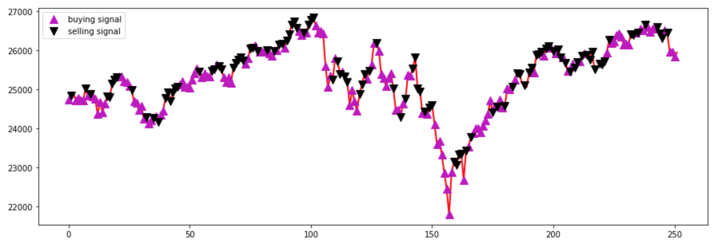

# Application of Deep Q-Learning (RL Algorithm) in stock trading.

### Elements of the RL: state, action, reward, next state

Agent will learn to trade given three actions for DJIA over course of one year: BUY, SELL, or HOLD. For every state the agent will act, record in its environment the reward, and replay the next state given its approximation of the Q-Learning function (bellman equation).

